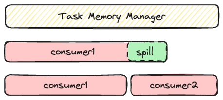

# 内存管理

## 管理的是哪些内存
我们将一个Spark应用的内存区域分为3块: 保留内存区, Spark内存区, 用户内存区.

### 保留内存
保留内存用于Spark框架本身运行的一些必要内存, 默认300MB. 比如driver记录的作业状态信息, executor的hadoop客户端, 任务信息等等.

### Spark内存
分为2种: 执行内存和存储内存.
执行内存包括shuffle, join, sort, agg等操作所需要的内存.
存储内存包括cache等数据占用内存.

### 用户内存
用户数据结构, 用户代码等.

为什么需要管理它们？
- 稳定性
  - 用量可控
  - 高适应性 -- 当执行内存不够时, 可以借用存储内存.
  - 其他
- 性能
  - 资源池化, 减少内存分配/释放次数. 当Buffer用，借此来控制Spill的频率.
  - Cache.

# 如何实现

关键组件
- TaskMemoryManager
- UnifiedMemoryManager
- MemoryPool

内存模式分为堆内, 堆外

内存用途分为2种 -- 执行内存, 存储内存

Spark可以分配的最大堆内存容量:

`systemMemory = JVM max heap`

`reservedMemory = 300MB`

`maxHeapMemory = (systemMemory - reservedMemory) * spark.memory.fraction(默认0.6)`

存储内存默认值是: `maxHeapMemory * spark.memory.storageFraction(默认0.5)`

Spark为堆内外分别设立内存池.
堆内内存池总量 = maxHeapMemory

堆外内存池总量 = spark.memory.offHeap.size

存储内存和执行内存同样遵循上面的storageFraction比例
这是初始的比例. Spark引入UnifiedMemoryManager可以在一定程度上动态调整执行内存和存储内存的大小, 以适应任务需求.

这里的MemoryManager是JVM粒度的. 每个任务会有自己的*TaskMemoryManager*.

MemoryManager确保如果当前executor上有N个在运行的任务, 任务可以获得1/2N ~ 1/N的内存. 在获得1/2N内存之前不会进行spill. ps: 这个N是随着任务状态动态变化的.

内存的使用方是*MemoryConsumer*
有哪些MemoryConsumer?
- ShuffleExternalSorter
- ExternalSorter
- UnsafeExternalSorter
- ExternalAppendOnlyMap
- and so on...

内存管理的直接入口是TaskMemoryManager

**首先由UnifiedMemoryManager借用/讨回存储内存**
1. 讨回被存储借用的内存，使存储区域缩回storage region size

2. 如果存储区域有空闲的可以直接占用

**如果没有获得足够的内存，TaskMemoryManager则会触发任务内其他consumer的spill.**

任务1不会spill任务2的memory consumer，spill只会被同任务consumer触发。内存不够时，任务2只会被动等待任务1释放内存。比如作业刚启动时，executor1被分配了1个task1，那么此时这个task1可以扩大自己的内存，最大可以独占执行内存（1/N，N=1）。过了一会，来了第二个task，此时task2需要等待task1释放一部分内存，当task2可以至少获取到1/2N（此时N=2）的执行内存时就可以继续了。

**最后尝试spill自己（最后spill自己是为了避免spill太频繁）**